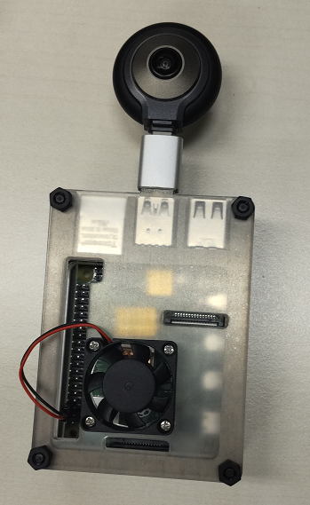

# Modifications for LyfieEye200 360 VR Camera
This version of cam2web ha been modified to tet LyfieEye200 VR360 camera.




## Linux version
LyfieEye200 support is implemented for Linux environment which inclues Raspberry Pi and other SBCs.


## Modifications
Modification includes the following featuers:
* When starting, cam2web shows available Video Capabilities such as Resolution ,and FrameRate and Encode type (YUYV or MJPEG).
* The following are available for LyfieEye200 360 VR camera
```
#0 YUYV 256 x 256@30
#1 YUYV 368 x 368@30
#2 YUYV 512 x 256@30 (default)
#3 YUYV 736 x 368@30
#4 MJPG 2976 x 1392@24
#5 MJPG 2976 x 1392@20
#6 MJPG 2976 x 1392@10
#7 MJPG 2240 x 1056@24
#8 MJPG 2240 x 1056@20
#9 MJPG 2240 x 1056@10
#10 MJPG 1488 x 1392@24
#11 MJPG 1488 x 1392@20
#12 MJPG 1488 x 1392@10
#13 MJPG 512 x 256@30
#14 MJPG 736 x 368@30
#15 MJPG 256 x 256@30
#16 MJPG 368 x 368@30
```
* -size parameter support above 0 to 16 value.
```
i.e run with resolution 736x368 at 30FPS
./cam2web -size:3
```

## Building on Linux and Raspberry Pi
Makefiles for GNU make are provided for both web2h and cam2web. Running bellow commands from the project’s root folder, will produce the required executables in **build/gcc/release/bin**.
```Bash
pushd .
cd src/tools/web2h/make/gcc/
make
popd

pushd .
cd src/apps/linux/
# or cd src/apps/pi/
make
popd
```
Note: libjpeg development library must be installed for cam2web build to succeed (which may not be installed by default) :
```
sudo apt-get install libjpeg-dev
```

# Accessing camera from other applications (WEB API)

The streamed camera can be accessed not only from web browser, but also from any other application supporting MJPEG streams (like VLC media player, for example, or different applications for IP cameras monitoring). The URL format to access MJPEG stream is:
```
http://ip:port/camera/mjpeg
```

In the case an individual image is required, the next URL provides the latest camera snapshot:
```
http://ip:port/camera/jpeg
```

### Camera information
To get some camera information, like device name, width, height, etc., an HTTP GET request should be sent the next URL:
```
http://ip:port/camera/info
```
It provides reply in JSON format, which may look like the one below:
```JSON
{
	"status":"OK",
	"config":
	{
		"device":"Video for LyfieEye200 Camera",
		"height":"256",
		"title":"Video for LyfieEye200 Camera",
		"width":"512"
	}
}
````
### Changing camera’s settings,  Getting description of camera properties
Those functions are not implemented yet.

### Getting version information
To get information about version of the cam2web application streaming the camera, the next URL is used
```
http://ip:port/version
```

### Access rights
Accessing JPEG, MJPEG and camera information URLs is available to those who can view the camera. Access to camera configuration URL is available to those who can configure it. The version URL is accessible to anyone. See [Running cam2web](Running.md) for more information about access rights.


### LyfieEye Product Information
https://www.aerotap.com/lyfie.html

